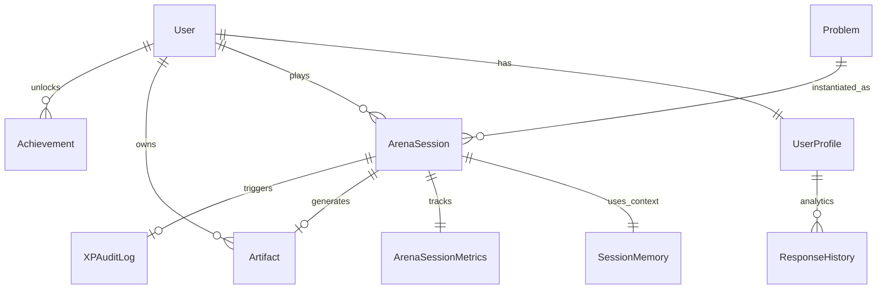

# NovaX Platform — Actual Database Schema Documentation

> **Status**: Live / Implementation  
> **Type**: MongoDB (Mongoose Schemas)  
> **Last Updated**: 2026-02-20

Dokumen ini merepresentasikan struktur database aktual yang digunakan dalam kode backend saat ini (folder `src/models/`).

---

## 1. Core Collections Overview

| Collection | Model File | Deskripsi Utama |
|---|---|---|
| **users** | `User.js` | Autentikasi dasar (email/password). |
| **userprofiles** | `UserProfile.js` | Profil lengkap, atribut psikometrik, XP, level, dan progres. |
| **problems** | `Problem.js` | Skenario masalah bisnis (AI-generated atau manual). |
| **arenasessions** | `ArenaSession.js` | Log sesi pengerjaan masalah oleh user. |
| **arenasessionmetrics**| `ArenaSessionMetrics.js` | Metrik real-time (keystroke, timing, intervention). |
| **sessionmemories** | `SessionMemory.js` | Context window sementara untuk AI agent selama sesi. |
| **achievements** | `Achievement.js` | Badges dan pencapaian user. |
| **artifacts** | `Artifact.js` | Solusi final user yang diabadikan (Immutable). |
| **difficultybaselines**| `DifficultyBaseline.js` | Standar benchmark statis per level difficulty. |
| **responsehistories** | `ResponseHistory.js` | Log pola jawaban untuk deteksi kemiripan/exploit. |
| **xpauditlogs** | `XPAuditLog.js` | Log audit perubahan XP (Immutable). |

---

## 2. Detailed Schema Definitions

### 2.1 User & Profile

#### `users` (Auth)
- **_id**: ObjectId
- **email**: String (Unique, Indexed)
- **password**: String (Hashed bcrypt)
- **name**: String
- **created_at**: Date

#### `userprofiles` (Game State & Stats)
Menyimpan state "RPG" user.
- **user_id**: String (Ref: users)
- **Primary Stats**:
  - `risk_appetite`, `decision_speed`, `ambiguity_tolerance`, `experience_depth` (0.1 - 0.9)
- **Archetype System**:
  - `primary_archetype`: Enum (risk_taker, analyst, builder, strategist)
  - `xp_[archetype]`: Number (Total XP per tipe)
  - `level_[archetype]`: Number (Level 1-100 per tipe)
- **Progression**:
  - `current_difficulty`: Number (1-10)
  - `highest_difficulty_conquered`: Number
  - `xp_state`: Enum (progressing, stagnating, frozen)
- **Metadata**: `domain`, `aspiration`, `age_group`

### 2.2 Core Gameplay (Arena)

#### `problems` (Content)
- **problem_id**: String (Unique)
- **Content**: `title`, `context`, `objective`, `constraints`[]
- **Difficulty**: Number (1-10)
- **Targeting**: `role_label`, `domain`, `duration_type` (quick/standard)
- **AI Params**: `personalization_factors` (target training/sharpening)

#### `arenasessions` (Transaction)
Satu record per kali user mengerjakan problem.
- **Status**: `status` (in_progress, evaluated, abandoned)
- **Context**: `difficulty_at_start`, `archetype_at_start`
- **Result**: `solution_text`, `ai_evaluation`, `ai_insight`
- **Rewards**: `xp_earned`, `xp_breakdown` (JSON), `level_up_achieved`

### 2.3 AI & Real-time Systems

#### `sessionmemories` (AI Context)
Penyimpanan sementara (< 24 jam) untuk context AI.
- **Snapshots**: Salinan `problem` dan `user_profile` saat sesi dimulai.
- **Conversation**: Array of message (role, content, intent).
- **AI Decisions**: Log keputusan internal AI (misal: `send_warning`, `adjust_difficulty`).

#### `arenasessionmetrics` (Telemetry)
- **Response Times**: Per pertanyaan (time_to_start, time_to_submit, pause_count).
- **Aggregates**: `avg_response_speed`, `decision_confidence_score` (1-10).
- **Interventions**: Log intervensi AI dan efektivitasnya.

### 2.4 Integrity & History

#### `artifacts` (Immutable Solutions)
Solusi user yang "dibekukan" sebagai portofolio.
- **Sifat**: Immutable (Update = Error).
- **Content**: `solution_summary`, `insight`, `xp_snapshot`.
- **Versioning**: `version`, `supersedes`, `superseded_by`.

#### `responsehistories` (Anti-Cheat)
- **Detection**: `response_hash`, `keywords`[], `decision_patterns`.
- **Function**: Digunakan untuk mendeteksi `pattern_replay` atau `copy-paste` antar sesi.

#### `xpauditlogs` (Immutable Ledger)
- **Action**: award, freeze, penalty.
- **Data**: `xp_before`, `xp_after`, `xp_change`.
- **Source**: Hanya boleh `arena_submit`.
- **Sifat**: Immutable (No Update/Delete).

---

## 3. Key Relationships

## 4. Perbedaan dengan Dokumen Rencana (RAW DATABASE ARCHITECTURE.md)

| Fitur | Implementasi Saat Ini (MongoDB) | Rencana Masa Depan (PostgreSQL) |
|---|---|---|
| **Database Engine** | MongoDB (Mongoose) | PostgreSQL 16 |
| **Vector Search** | Belum terlihat native di schema (kemungkinan via eksternal/AI service) | pgvector (Native) |
| **Search Engine** | Regex / MongoDB Text Search | Meilisearch |
| **Foto Profil** | `avatar_url` (String) di UserProfile | Tabel terpisah / Object Storage Ref |
| **Strictness** | Schema fleksibel (Mongoose) | Strict SQL Schema + JSONB |
