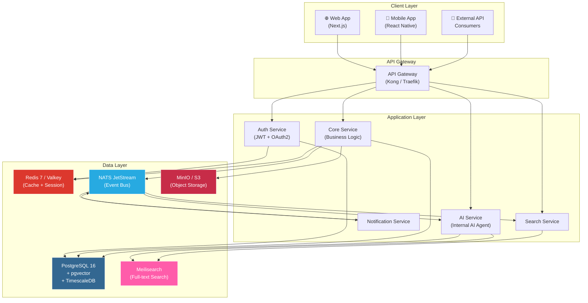
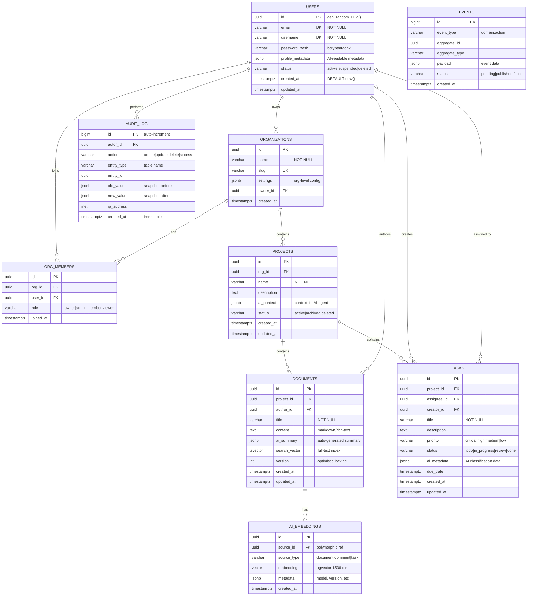
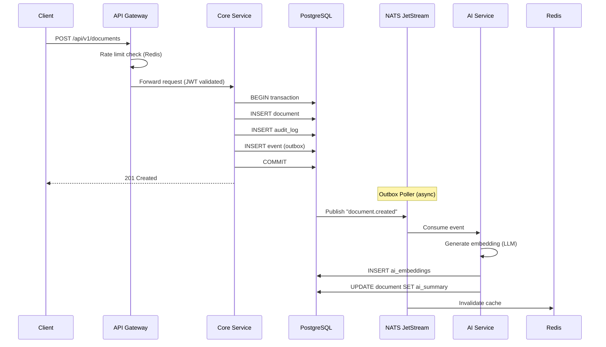
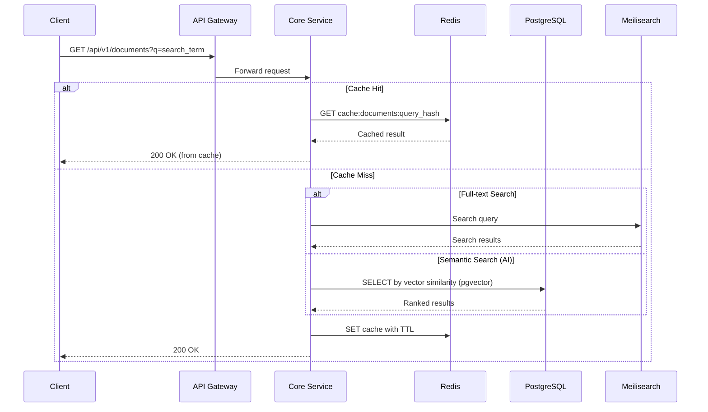
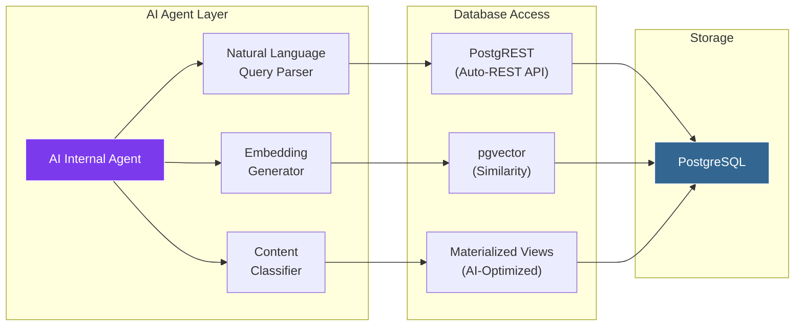
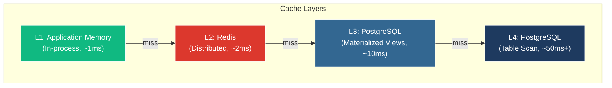
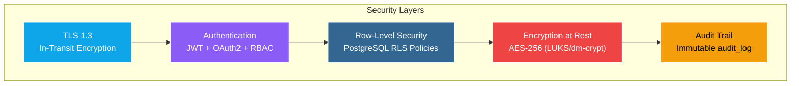
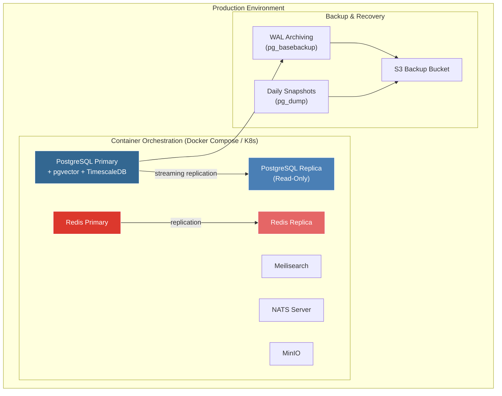

# NovaX Platform — Database Architecture & Tech Stack

> **Version**: 1.0.0  
> **Date**: 2026-02-18  
> **Status**: Draft  
> **AI-Readable**: Yes — Dokumen ini dirancang agar dapat dipahami oleh AI internal platform NovaX.

---

## 1. Ringkasan Eksekutif

Dokumen ini mendefinisikan arsitektur database dan tech stack untuk **NovaX Platform** — sebuah platform digital modern yang membutuhkan skalabilitas, efisiensi, kecepatan tinggi, dan kemampuan untuk dipahami oleh AI internal. Arsitektur ini menggunakan pendekatan **Polyglot Persistence** — memilih database terbaik untuk setiap kebutuhan spesifik.

---

## 2. Prinsip Arsitektur

| Prinsip | Deskripsi |
|---|---|
| **Polyglot Persistence** | Gunakan database yang tepat untuk setiap use-case |
| **AI-First Schema** | Schema dirancang agar mudah di-query oleh AI agent |
| **Event-Driven** | Perubahan data dipropagasi via event stream |
| **Immutable Audit Trail** | Semua mutasi tercatat untuk traceability |
| **Horizontal Scalability** | Semua komponen bisa di-scale secara horizontal |
| **Zero-Downtime Migration** | Schema migration tanpa downtime |

---

## 3. Tech Stack Overview

### 3.1 Database Layer Selection

```
┌─────────────────────────────────────────────────────────────────────┐
│                     NovaX Database Tech Stack                       │
├─────────────────┬───────────────────┬───────────────────────────────┤
│ Layer           │ Technology        │ Purpose                       │
├─────────────────┼───────────────────┼───────────────────────────────┤
│ Primary RDBMS   │ PostgreSQL 16     │ Core transactional data       │
│ Cache Layer     │ Redis 7 (Valkey)  │ Session, cache, rate-limiting │
│ Search Engine   │ Meilisearch       │ Full-text search, filtering   │
│ Vector DB       │ pgvector (ext)    │ AI embeddings & similarity    │
│ Message Queue   │ NATS JetStream    │ Event streaming & pub/sub     │
│ Object Storage  │ MinIO / S3       │ File, media, backup           │
│ Time-Series     │ TimescaleDB (ext) │ Metrics, analytics, logs      │
└─────────────────┴───────────────────┴───────────────────────────────┘
```

### 3.2 Justifikasi Pemilihan Tech Stack

#### PostgreSQL 16 — Primary Database

| Kriteria | Skor |
|---|---|
| Maturitas & Stabilitas | ★★★★★ |
| SQL Standard Compliance | ★★★★★ |
| Extension Ecosystem | ★★★★★ |
| AI/ML Integration (pgvector) | ★★★★☆ |
| JSON/JSONB Support | ★★★★★ |
| Community & Support | ★★★★★ |

**Alasan utama**:
- **pgvector** extension memungkinkan penyimpanan embedding AI langsung di PostgreSQL tanpa database terpisah — mengurangi operational complexity.
- **TimescaleDB** extension menambah kapabilitas time-series tanpa infrastruktur tambahan.
- **JSONB** column memungkinkan schema semi-structured untuk fleksibilitas AI agent.
- Row-Level Security (RLS) untuk multi-tenancy yang aman.

#### Redis 7 / Valkey — Cache & Session

**Alasan**: Latensi sub-millisecond, data structure yang kaya (sorted set, stream, pub/sub), dan ekosistem yang mature. Valkey sebagai opsi open-source fork.

#### Meilisearch — Search Engine

**Alasan**: Lebih ringan dari Elasticsearch, typo-tolerant, instant search (<50ms), dan mudah diintegrasikan. Cocok untuk platform yang membutuhkan search cepat tanpa overhead cluster management.

#### NATS JetStream — Event Streaming

**Alasan**: Lebih ringan dari Kafka, single binary deployment, at-least-once delivery, dan native support untuk request/reply pattern. Ideal untuk event-driven architecture skala menengah.

---

## 4. System Architecture Diagram



---

## 5. Database Schema Design

### 5.1 Entity Relationship Diagram (ERD)



### 5.2 Schema AI-Readability Conventions

Agar AI internal dapat memahami dan berinteraksi dengan database secara efektif, semua tabel mengikuti konvensi berikut:

```yaml
ai_schema_conventions:
  naming:
    tables: "snake_case, plural nouns"
    columns: "snake_case, descriptive"
    foreign_keys: "{referenced_table_singular}_id"
    indexes: "idx_{table}_{column(s)}"
  
  metadata_columns:
    ai_context: "JSONB — konteks untuk AI agent tentang entity"
    ai_summary: "JSONB — ringkasan auto-generated oleh AI"
    ai_metadata: "JSONB — klasifikasi dan tag dari AI"
  
  standard_columns:
    - "id: UUID primary key (gen_random_uuid)"
    - "created_at: timestamptz DEFAULT now()"
    - "updated_at: timestamptz (trigger-managed)"
    - "status: varchar dengan enum check constraint"
  
  search_support:
    full_text: "tsvector column + GIN index"
    vector_similarity: "pgvector + HNSW index"
    semantic_search: "AI embedding → cosine similarity"
```

---

## 6. Data Flow Architecture

### 6.1 Write Path — Command Flow



### 6.2 Read Path — Query Flow



---

## 7. AI Internal Integration Layer

### 7.1 Bagaimana AI Berinteraksi dengan Database



### 7.2 AI-Optimized Database Views

```sql
-- View: Semua dokumen dengan metadata AI untuk agent consumption
CREATE MATERIALIZED VIEW mv_ai_document_context AS
SELECT 
    d.id,
    d.title,
    d.content,
    d.ai_summary,
    d.search_vector,
    e.embedding,
    p.name AS project_name,
    p.ai_context AS project_context,
    o.name AS org_name,
    u.username AS author,
    d.created_at,
    d.updated_at
FROM documents d
LEFT JOIN ai_embeddings e ON e.source_id = d.id AND e.source_type = 'document'
JOIN projects p ON p.id = d.project_id
JOIN organizations o ON o.id = p.org_id
JOIN users u ON u.id = d.author_id
WHERE d.status != 'deleted';

-- Auto-refresh setiap 5 menit
-- (dikelola via pg_cron extension)

-- View: Task intelligence untuk AI prioritization
CREATE MATERIALIZED VIEW mv_ai_task_intelligence AS
SELECT
    t.id,
    t.title,
    t.description,
    t.priority,
    t.status,
    t.ai_metadata,
    t.due_date,
    t.created_at,
    p.name AS project_name,
    u_assignee.username AS assignee,
    u_creator.username AS creator,
    CASE 
        WHEN t.due_date < NOW() THEN 'overdue'
        WHEN t.due_date < NOW() + INTERVAL '24 hours' THEN 'urgent'
        WHEN t.due_date < NOW() + INTERVAL '7 days' THEN 'upcoming'
        ELSE 'scheduled'
    END AS urgency_level
FROM tasks t
JOIN projects p ON p.id = t.project_id
LEFT JOIN users u_assignee ON u_assignee.id = t.assignee_id
JOIN users u_creator ON u_creator.id = t.creator_id
WHERE t.status != 'done';
```

### 7.3 Semantic Search Query untuk AI

```sql
-- AI agent melakukan semantic search via pgvector
-- Input: embedding dari query user (1536-dim vector)
SELECT 
    d.id,
    d.title,
    d.ai_summary,
    1 - (e.embedding <=> $1::vector) AS similarity_score
FROM documents d
JOIN ai_embeddings e ON e.source_id = d.id
WHERE e.source_type = 'document'
    AND 1 - (e.embedding <=> $1::vector) > 0.75  -- threshold
ORDER BY e.embedding <=> $1::vector
LIMIT 10;
```

---

## 8. Indexing Strategy

### 8.1 Index Map

```
┌────────────────────────────────────────────────────────────────────┐
│                       Indexing Strategy                             │
├──────────────┬────────────────────┬──────────────┬─────────────────┤
│ Table        │ Column(s)          │ Type         │ Purpose         │
├──────────────┼────────────────────┼──────────────┼─────────────────┤
│ users        │ email              │ UNIQUE BTREE │ Login lookup    │
│ users        │ username           │ UNIQUE BTREE │ Profile lookup  │
│ documents    │ search_vector      │ GIN          │ Full-text srch  │
│ documents    │ project_id         │ BTREE        │ Project filter  │
│ documents    │ (project_id, status, created_at) │ BTREE composite │ Listing query   │
│ ai_embeddings│ embedding          │ HNSW         │ Vector search   │
│ ai_embeddings│ (source_id, type)  │ BTREE        │ Source lookup   │
│ tasks        │ (project_id, status) │ BTREE      │ Board query     │
│ tasks        │ assignee_id        │ BTREE        │ My tasks query  │
│ tasks        │ due_date           │ BTREE        │ Deadline sort   │
│ audit_log    │ (entity_type, entity_id) │ BTREE  │ Entity history  │
│ audit_log    │ created_at         │ BRIN         │ Time-range scan │
│ events       │ (status, created_at) │ BTREE     │ Outbox polling  │
│ org_members  │ (org_id, user_id)  │ UNIQUE BTREE│ Membership chk  │
└──────────────┴────────────────────┴──────────────┴─────────────────┘
```

### 8.2 Partitioning Strategy

```sql
-- Audit log: partitioned by month (range partitioning)
CREATE TABLE audit_log (
    id BIGINT GENERATED ALWAYS AS IDENTITY,
    actor_id UUID NOT NULL,
    action VARCHAR(50) NOT NULL,
    entity_type VARCHAR(100) NOT NULL,
    entity_id UUID NOT NULL,
    old_value JSONB,
    new_value JSONB,
    ip_address INET,
    created_at TIMESTAMPTZ NOT NULL DEFAULT NOW()
) PARTITION BY RANGE (created_at);

-- Auto-create monthly partitions
CREATE TABLE audit_log_2026_01 PARTITION OF audit_log
    FOR VALUES FROM ('2026-01-01') TO ('2026-02-01');
CREATE TABLE audit_log_2026_02 PARTITION OF audit_log
    FOR VALUES FROM ('2026-02-01') TO ('2026-03-01');
-- ... managed via pg_partman extension

-- Events: partitioned by status for efficient outbox polling
CREATE TABLE events (
    id BIGINT GENERATED ALWAYS AS IDENTITY,
    event_type VARCHAR(255) NOT NULL,
    aggregate_id UUID,
    aggregate_type VARCHAR(100),
    payload JSONB NOT NULL,
    status VARCHAR(20) DEFAULT 'pending',
    created_at TIMESTAMPTZ DEFAULT NOW()
) PARTITION BY LIST (status);

CREATE TABLE events_pending PARTITION OF events FOR VALUES IN ('pending');
CREATE TABLE events_published PARTITION OF events FOR VALUES IN ('published');
CREATE TABLE events_failed PARTITION OF events FOR VALUES IN ('failed');
```

---

## 9. Caching Strategy



### Cache Key Patterns

```yaml
cache_patterns:
  session:
    key: "session:{session_id}"
    ttl: 3600  # 1 jam
    type: "hash"
  
  user_profile:
    key: "user:{user_id}:profile"
    ttl: 1800  # 30 menit
    type: "string (JSON)"
  
  document_list:
    key: "project:{project_id}:docs:page:{page}"
    ttl: 300   # 5 menit
    type: "string (JSON)"
    invalidation: "on document.created/updated/deleted event"
  
  search_result:
    key: "search:{query_hash}:{filters_hash}"
    ttl: 120   # 2 menit
    type: "string (JSON)"
  
  rate_limit:
    key: "ratelimit:{user_id}:{endpoint}"
    ttl: 60    # 1 menit window
    type: "sorted set (sliding window)"
```

---

## 10. Security Architecture



### Row-Level Security (Multi-tenancy)

```sql
-- Hanya user dalam organisasi yang sama yang bisa akses data
ALTER TABLE documents ENABLE ROW LEVEL SECURITY;

CREATE POLICY org_isolation ON documents
    USING (
        project_id IN (
            SELECT p.id FROM projects p
            JOIN org_members om ON om.org_id = p.org_id
            WHERE om.user_id = current_setting('app.current_user_id')::UUID
        )
    );

-- AI agent menggunakan service role khusus
CREATE ROLE ai_agent_role;
GRANT SELECT ON mv_ai_document_context TO ai_agent_role;
GRANT SELECT ON mv_ai_task_intelligence TO ai_agent_role;
GRANT INSERT ON ai_embeddings TO ai_agent_role;
GRANT UPDATE (ai_summary, ai_metadata) ON documents TO ai_agent_role;
-- AI agent TIDAK bisa DELETE atau mengubah data user
```

---

## 11. Deployment Architecture



### Docker Compose Reference

```yaml
# docker-compose.yml (simplified)
version: "3.9"
services:
  postgres:
    image: pgvector/pgvector:pg16
    environment:
      POSTGRES_DB: novax
      POSTGRES_USER: novax_admin
      POSTGRES_PASSWORD: ${PG_PASSWORD}
    volumes:
      - pg_data:/var/lib/postgresql/data
      - ./init.sql:/docker-entrypoint-initdb.d/init.sql
    ports:
      - "5432:5432"
    deploy:
      resources:
        limits:
          memory: 2G

  redis:
    image: redis:7-alpine
    command: redis-server --maxmemory 512mb --maxmemory-policy allkeys-lru
    ports:
      - "6379:6379"

  meilisearch:
    image: getmeili/meilisearch:v1.6
    environment:
      MEILI_MASTER_KEY: ${MEILI_KEY}
    volumes:
      - meili_data:/meili_data
    ports:
      - "7700:7700"

  nats:
    image: nats:2.10-alpine
    command: ["--jetstream", "--store_dir", "/data"]
    volumes:
      - nats_data:/data
    ports:
      - "4222:4222"

  minio:
    image: minio/minio
    command: server /data --console-address ":9001"
    environment:
      MINIO_ROOT_USER: ${MINIO_USER}
      MINIO_ROOT_PASSWORD: ${MINIO_PASSWORD}
    volumes:
      - minio_data:/data
    ports:
      - "9000:9000"
      - "9001:9001"

volumes:
  pg_data:
  meili_data:
  nats_data:
  minio_data:
```

---

## 12. Performance Targets & Monitoring

### 12.1 SLA Targets

| Metrik | Target | Measurement |
|---|---|---|
| API Response (p50) | < 50ms | Application APM |
| API Response (p99) | < 200ms | Application APM |
| Database Query (p50) | < 10ms | pg_stat_statements |
| Database Query (p99) | < 100ms | pg_stat_statements |
| Search Latency | < 50ms | Meilisearch dashboard |
| Vector Search | < 100ms | Custom metric |
| Cache Hit Rate | > 85% | Redis INFO stats |
| Uptime | 99.9% | Health check monitor |

### 12.2 Monitoring Stack

```yaml
monitoring:
  database:
    - pg_stat_statements  # Query performance
    - pg_stat_activity    # Active connections
    - pgbouncer           # Connection pooling metrics
  
  application:
    - OpenTelemetry SDK   # Distributed tracing
    - Prometheus          # Metrics collection
    - Grafana             # Visualization
  
  alerting:
    - Grafana Alerting    # threshold-based alerts
    - PagerDuty / Slack   # notification channels
```

---

## 13. Migration Strategy

### 13.1 Tools

| Tool | Purpose |
|---|---|
| **golang-migrate** | Schema versioning & migration |
| **pg_partman** | Auto partition management |
| **pg_cron** | Scheduled jobs (MV refresh, cleanup) |

### 13.2 Migration Workflow


---

## 14. AI-Internal Metadata Schema

Bagian ini mendefinisikan bagaimana metadata terstruktur agar AI internal dapat membaca, memahami, dan bertindak berdasarkan data di platform.

```jsonc
// Contoh: ai_context pada tabel projects
{
  "domain": "software_engineering",
  "keywords": ["web", "platform", "collaboration"],
  "classification": {
    "industry": "technology",
    "type": "internal_tool",
    "maturity": "mvp"
  },
  "ai_instructions": {
    "summarization_style": "concise_technical",
    "language": "id",  // bahasa Indonesia
    "response_format": "markdown",
    "context_window_priority": ["title", "description", "recent_activity"]
  },
  "relationships": {
    "parent_org": "uuid-of-org",
    "related_projects": ["uuid-1", "uuid-2"],
    "tags": ["novax", "core", "v1"]
  }
}

// Contoh: ai_summary pada tabel documents
{
  "summary": "Dokumen ini membahas arsitektur microservice...",
  "key_topics": ["microservice", "database", "scalability"],
  "sentiment": "neutral",
  "complexity_score": 7,
  "generated_at": "2026-02-18T12:00:00Z",
  "model": "novax-internal-v1",
  "confidence": 0.92
}
```

---

## 15. Appendix

### 15.1 Perbandingan Database yang Dipertimbangkan

| Kriteria | PostgreSQL | MySQL | MongoDB | CockroachDB |
|---|---|---|---|---|
| ACID Compliance | ✅ Full | ✅ Full | ⚠️ Partial | ✅ Full |
| JSON Support | ✅ JSONB + Index | ⚠️ JSON | ✅ Native | ✅ JSONB |
| Vector Search | ✅ pgvector | ❌ | ✅ Atlas Search | ❌ |
| Time-Series | ✅ TimescaleDB | ❌ | ⚠️ TTL Index | ❌ |
| RLS (Multi-tenant) | ✅ Native | ❌ | ❌ | ❌ |
| Extension Ecosystem | ★★★★★ | ★★★☆☆ | ★★☆☆☆ | ★★☆☆☆ |
| AI/ML Ready | ★★★★★ | ★★☆☆☆ | ★★★☆☆ | ★★☆☆☆ |
| **Verdict** | ✅ **Dipilih** | ❌ | ❌ | ❌ |

### 15.2 Estimated Resource Requirements

| Komponen | CPU | RAM | Storage | Instance |
|---|---|---|---|---|
| PostgreSQL Primary | 4 vCPU | 8 GB | 100 GB SSD | 1 |
| PostgreSQL Replica | 2 vCPU | 4 GB | 100 GB SSD | 1 |
| Redis | 1 vCPU | 1 GB | — | 1 |
| Meilisearch | 2 vCPU | 2 GB | 20 GB SSD | 1 |
| NATS | 1 vCPU | 512 MB | 10 GB SSD | 1 |
| MinIO | 2 vCPU | 2 GB | 500 GB HDD | 1 |
| **Total (MVP)** | **12 vCPU** | **17.5 GB** | **730 GB** | **6** |

---

> **Catatan untuk AI Internal**: Dokumen ini menggunakan konvensi penamaan konsisten, schema JSONB terdokumentasi, dan materialized view yang dioptimalkan untuk akses AI. Gunakan `mv_ai_document_context` dan `mv_ai_task_intelligence` sebagai sumber data utama. Semua embedding disimpan dalam format pgvector 1536-dimensi, kompatibel dengan model OpenAI `text-embedding-3-small`.
